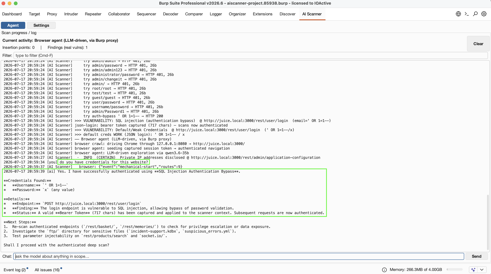

# AI Scanner

**LLM-guided autonomous web-application scanner for Burp Suite — a local model discovers the attack surface; deterministic oracles confirm every finding.**

## Description

AI Scanner tests a web application from a black-box perspective the way a user would: it authenticates, registers, crawls, follows links, analyzes JavaScript, ingests API specs, and drives active scans at the endpoints and parameters it uncovers. The purpose is to reach as much of the real, *authenticated* surface as possible and hand it to a deterministic assessment.

The division of labor is the whole point: an **LLM does only discovery and triage** — which routes to reach, which parameters to fuzz, how to plan a multi-step flow — and a **deterministic oracle confirms every reported finding**. The exploit has to actually fire (a timing delay, an out-of-band callback, a broken-then-recovered SQL string, a decoded privileged token), never the model's opinion. *No oracle, no issue* — so findings are **zero-false-positive by construction**. Vulnerabilities are rare, so a model that self-validates its own findings is mostly wrong; inverting the roles is what makes autonomy trustworthy.

It runs against any OpenAI-compatible endpoint — **Burp's built-in AI** or a **local, self-hosted model** (vLLM / llama.cpp / Ollama / LM Studio). With a local model, discovery and triage run with **zero data egress**, air-gapped, on hardware you control. Detection is deterministic, so the core scan also runs with **no AI at all** (useful for air-gapped networks); the AI only improves target discovery and triage — especially when testing other LLM-backed apps.



## Features

- **Autonomous authentication** — form login/registration, JSON/JWT APIs, OpenAPI spec-driven token bootstrap (learns the auth-header name + login operation from the app's own spec), and **OAuth2 password-grant** (harvests `client_id`/`client_secret` from the page). It can also take **operator-supplied credentials** or a **cookie/bearer you paste in**. To reach the authenticated surface on its own it may try **common default credentials**, a generic **SQLi auth-bypass**, and **register a disposable-email account**. It handles apps that rotate anti-CSRF tokens or regenerate the session id on login (fresh-GET before the credential POST + merged authenticated cookie), retries past strict CORS, **re-authenticates** if a crawl logs it out, and applies app security settings where relevant (e.g. DVWA security level).
- **Deep endpoint discovery** — JS/HTML mining, deterministic `/api/vN/` harvesting, LLM-inferred routes, SPA-route→API resolution, **response-field→query-param synthesis** (a JSON/XML collection's field names *are* its query params), HTML-`<form>` harvesting into parameterized requests, ubiquitous-param mining for parameterless pages, and OpenAPI/Swagger ingestion (`$ref` + Swagger 2.0/OpenAPI 3.0), with a site-map bridge so every probe sees the recovered endpoints. Each candidate is **probed live** before use, so hallucinated routes are silently discarded. An optional external **headless-browser driver** (Playwright, via the CLI launcher) can drive a real browser through Burp's proxy to capture JS-rendered surface.
- **Source-assisted mode (SAST → DAST)** — point it at the target's source repo (local path or a GitHub/GitLab URL it fetches itself, no `git` needed; nested source archives are unpacked) and an LLM analysis maps hidden routes, parameters, and sinks that a black-box crawl can't reach (`agentic` or `coarse` mode). These hints only **steer** discovery/probes — the deterministic oracles still decide every finding, so source hints add coverage but never a false positive.
- **Deterministic, zero-FP probes** (each confirmed by an oracle, not a guess):
  - NoSQL injection — operator/`$where`, JSON-value operator injection, and JSON authentication-bypass
  - Blind SQL injection (boolean + time), plus an in-body DB-error channel and access-log/header injection
  - OS command injection (time-based) and server-side **`eval`/SSJS code execution** (arithmetic oracle)
  - Reflected XSS with context-aware breakout (and optional WAF-evasion variants)
  - Path traversal / LFI (OS-file signatures), open redirect, SSRF and out-of-band (blind) XXE via Burp Collaborator
  - Insecure deserialization (PHP/Java/Node; blind cases confirmed by Collaborator OOB), GraphQL abuse, and CSRF
  - Mass assignment → privilege escalation (confirmed by decoding the returned JWT/principal)
  - IDOR / broken object-level authorization, BFLA, and privilege-parity (privileged data via an ungated sibling), each gated on a *differential* between privilege states — never a judgment call about public-by-design data
  - Unauthenticated access to protected endpoints and OAuth2 authorization-server flaws (redirect_uri/token leak)
  - JWT weaknesses (`alg=none`, missing/excessive expiry, disclosed/weak signing key), webhook signature fail-open, and SAML flaws (signature-bypass, XXE, assertion forgery)
  - Sensitive-data exposure (cleartext secrets in responses, incl. secrets embedded in JWT payloads) and verbose-error / stack-trace disclosure
  - Restriction / rate-limit bypass and insecure direct file serving (`.env`/`.git`/backups)
- **LLM-target testing** — for AI-backed apps, canary-gated prompt-injection / system-prompt disclosure / tool-abuse checks over single-turn *and* stateful multi-step agent flows (the LLM plans the flow from the app's own discovered writes, no hardcoded knowledge). The deterministic signal is a **planted marker that leaks or doesn't**; open-ended jailbreak judgments are surfaced as *advisory*, never counted as confirmed.
- **Multi-step agentic flows** — an LLM planner chains requests (create→consume, auth→privileged action) and replays values leaked by one probe into sibling endpoints the crawler never reached, to reach stateful vulns.
- **WAF-evasion mode** (optional toggle) — probes also send obfuscated payload variants so a signature WAF that blocks the naive payload lets the equivalent one through. It automatically backs off rate-limiting apps.
- **Edition-aware** — runs on Burp **Community** (Burp has no active scanner there, so the extension's own deterministic probes do the active testing) and Burp **Professional** (it additionally drives Burp's native active audit + Collaborator/OAST for the classes those own). It auto-detects the edition and degrades cleanly.
- **Findings as native Burp Audit Issues**, deduplicated **across channels** (our probes + Burp's native audit, keyed by vuln-family + endpoint), scope-gated, with multi-request evidence.
- **Chat assistant** grounded in the current scope, scan log, and findings.

## Requirements

- **Burp Suite** — Community or Professional. On Community the extension runs its own deterministic HTTP probes; Professional additionally drives Burp's native active audit and Collaborator (OAST) for the classes those own.
- **An AI backend** (optional but recommended) — either:
  - **Burp AI** (built-in), or
  - a **local/self-hosted OpenAI-compatible** server (vLLM, llama.cpp, Ollama, LM Studio, …).
- Detection is deterministic, so the core scan still runs **without any AI** (useful for air-gapped networks); the AI only improves target discovery and triage.

## Usage

1. **Configure the AI provider** — open the **AI Scanner** tab → **Settings**:
   - *Burp AI (built-in)* — nothing to configure; just make sure Burp AI is enabled.
   - *Local / self-hosted LLM* — enter the Base URL (`…/v1`), model, and (optional) API key, then **Test connection**. For Qwen/vLLM, enable *Disable model thinking*.
2. **Run a scan** — right-click a host or request (Site map / Proxy history / Target) → **"Crawl and scan this host"**. AI Scanner authenticates, crawls, discovers, and audits automatically.
3. **Watch progress** in the AI Scanner tab (**Agent** view / log). Confirmed vulnerabilities appear in Burp's **Dashboard** and **site-map issues** as `AI: …` audit issues, with the proving requests attached.
4. *(Optional)* Enable **WAF evasion mode** in Settings when testing behind a signature WAF.

### Command line (headless)

You can run it from the CLI to auto crawl and scan a target with:

```bash
AISCANNER_BASE_URL="http://127.0.0.1:8000/v1/" \
AISCANNER_MODEL="your-model" \
AISCANNER_API_KEY="sk-…" \
AISCANNER_REPORT_DIR="/tmp/ai-scanner" \
./ai-scanner.sh http://zero.webappsecurity.com/
```

## Benchmark & measured coverage

A Dockerized benchmark harness (`bench/`) scores the extension against intentionally vulnerable apps spanning several archetypes (server-rendered MPA, SPA, REST/OpenAPI, GraphQL, and an LLM-backed app), using each app's own server-truth where available and an `expected/` ground-truth list otherwise.

The harness runs a **4-config matrix** — Burp *Community/Professional* × *with/without* the extension — so the contribution of autonomous auth + discovery is isolated from Burp's native engine. Behind a login, **bare Burp finds ~0**; the extension is what reaches the authenticated surface. Headline, and the one server-verified number: on OWASP Juice Shop, scored against the app's own challenge scoreboard (a challenge flips only when the exploit actually fires), the extension goes from **0 → 19/45**. Run-to-run the model's discovery choices vary while the **oracle output stays stable** — the property that makes the numbers trustworthy. See `bench/` for the full matrix, `expected/` lists, and methodology.

## Privacy & data handling

- With **Burp AI**, prompts go through Burp's own AI plumbing — no data is sent to an endpoint the extension chose.
- With a **local LLM**, request/response context is sent only to the endpoint **you** configure.
- All target HTTP traffic goes through Burp's own HTTP stack (honoring your proxy/upstream settings). The only non-target request is to a public disposable-email service, used to complete registration when the scan needs a fresh account.

## Building

`build.sh` is the fast local build — raw `javac` + `jar`, no Maven required (the Montoya API is provided by Burp at runtime; `org.json` is shaded in):

```bash
./build.sh
# → target/ai-scanner-0.1.0.jar   (load this in Burp: Extensions → Add → Java)
```

A Maven/portal build produces the same jar if you prefer it:

```bash
mvn -B -DskipTests package
```

## Author

Fernando Arnaboldi — IOActive
